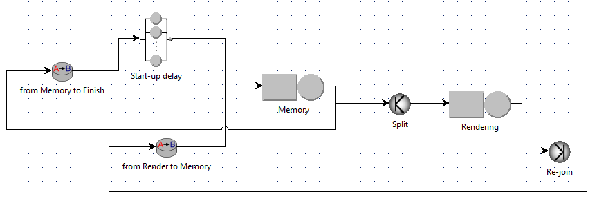

# Multiclass closed queuing network

The project consists of the modelling and evaluation of the performance of a multiclass closed queuing network. The analysis was made as a final project for the Computer System Performance Evaluation course @ Politecnico di Milano, A.Y. 2019-2020.

## Software
The modelling has been carried out using the [JSIMgraph simulator](http://jmt.sourceforge.net/JSIMg.html) (part of the JMT, Java Modeling Tools).

## Screenshots
Here, follows a screenshot of the model:

## Documentation
The full documentation (in Italian) of the analysis can be found in the [Documentation](./Documentazione.pdf) file.
